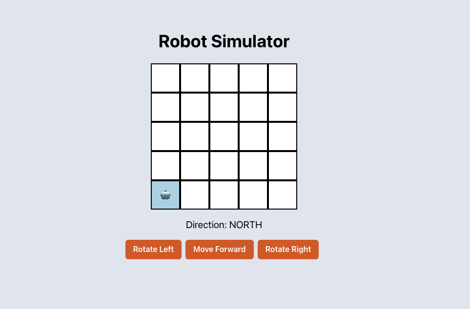

# Welcome to Astro Robot Simulator!



## Goal

Astro Robot Simulator is a web application that allows users to simulate controlling a robot on a 5x5 grid. The robot can be rotated left or right and moved forward based on its current direction (North, East, South, West). This project is built using Astro, React, and Chakra UI.

## Target Audience

Team Bellroy

### First Setup

- Clone the repository and install dependencies:

  ```
  git clone https://github.com/anLpk/astro-robot-simulator.git
  cd astro-robot-simulator
  npm install
  npm start
  ```

Running Tests

- To run the tests for the components:

  ```
  npm run test
  ```

## Acknowledgments

- **Astro**: For the static site generator.
- **Chakra UI**: For the UI components.
- **React**: For the interactive UI.
- **Jest**: For the testing framework.

## License

This project is licensed under the MIT License.
